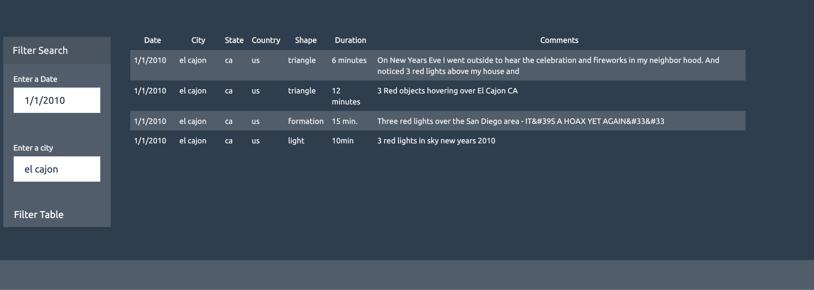

# Query UFO dataset

## javascript-challenge for RU Bootcamp
Matthew Richtmyer 08 Mar 2020

# Purpose:
* Practice Javascript DOM manipulation
* Access data from forms using D3 and use as query inputs
* Output only relevant elements to search queries

# Pseudo code:
* Build table based on query
  - Create a filter that restricts data input to match search query (e.g. city, date/time)
  - For each element in the queried dictionaries, access the correct element needed (e.g. city, date/time)
  - Store each of these elements into a new cell. Create new rows for new entries.
* Create button handler that accesses values from the form
  - Call build table function and use query values to construct table
  - Display table onto HTML
    
# Test: 
Both the date and city fields need to successfuly match an entry to produce a result. Please note that the the query is format and case sensitive. Successful cases include:
- Date: 1/1/2010 and City: benton
- Date: 1/1/2010 and City: el cajon

# Sample Result:

